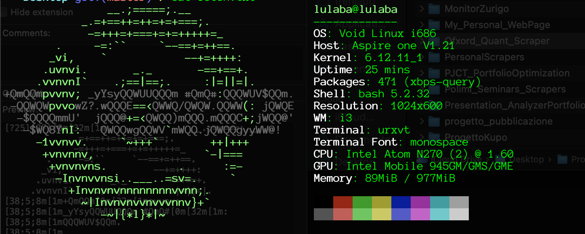

# my-linux

This repository contains .config files  of my Void-Linux setup. 

The setup offers a lightweight and minimal OS intended to work flawlessy on low-power machine.

My choice is an Acer Aspire D270, a 2010s netbook, with a 32-bit Intel Atom N270 and 1GB RAM, 
and a very compact screen size of 11".



## Installed Packages

- **X Window System (X11)** - This is the core graphical related package. It is required for anything GUI-related

- **i3 Window Manager** - Minimal and fast (tiling)  window manager.

- **urxvt** - Terminal emulator for X11

- **dillo** - Minimal GUI web-browser
  
- **mupdf** - fast and easy PDF/EPUB viewer

- **htop** - System performance monitor (CPU, memory, temps, etc.)
  
- **neofetch** - just for aesthetic photos :)

## Usage
Feel free to copy the configuration files!

Please remember to update file paths to match your own setup.

  

For more customization, refer to the official documentation linked below.

## Linux Installation
  

Start by creating partitions using `sudo cfdisk /dev/sda`, then format them with the `ext4` filesystem. For example:

```bash
mkfs.ext4 /dev/sda1     # /boot
mkfs.ext4 /dev/sda2     # /
mkswap /dev/sda3        # (optional swap)
swapon /dev/sda3        # enable swap
```

Next, mount the partitions:
```bash
mount /dev/sda2 /mnt             # Mount root
mkdir /mnt/boot                  # Create /boot
mount /dev/sda1 /mnt/boot        # Mount /boot
swapon /dev/sda3                 # Enable swap
```

Note that the SWAP partition is extra memory when your physical RAM is full. It’s slower, because it’s on disk, but helps prevent crashes or freezing.

Please follow [Void Installation Guide](https://docs.voidlinux.org/installation/live-images/guide.html) for complete and formal installation guidelines.


## Suggested resources
Below useful links I used during the process and highly suggest to have a look at them.

- [Void Linux ISO Download (i686)](https://voidlinux.org/download/#i686)
- [Void Linux Documentation](https://docs.voidlinux.org/installation/live-images/guide.html)
- [i3 User Guide](https://i3wm.org/docs/userguide.html)
